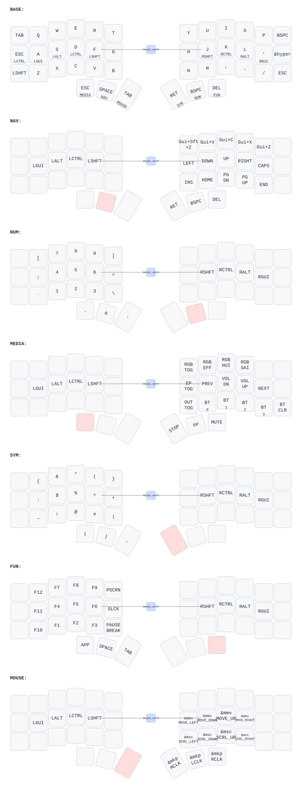

# Corne ZMK Keymap

Split ergonomic keyboard (42 keys) running [ZMK firmware](https://zmk.dev) on Nice!Nano v2.
Miryoku-style layout adapted from TOTEM config.

## Keymap

Auto-generated from [`config/corne.keymap`](config/corne.keymap) via [keymap-drawer](https://github.com/caksoylar/keymap-drawer):



The SVG updates automatically on push via the [Draw Keymap](.github/workflows/draw-keymap.yml) workflow.

## Display

- **Left (central):** Built-in ZMK status screen (layer, battery, BT)
- **Right (peripheral):** Custom modifiers widget (`C S A G`) + battery + BT status

## Interactive Viewer

```sh
make viewer
```

Press `?` for the cheat sheet. Press `0-6` to switch layers.

## Build Firmware

Push to `config/` or `build.yaml` triggers the [Build ZMK firmware](.github/workflows/build.yml) workflow. Download `.uf2` files from Actions artifacts.

## Regenerate Keymap SVG

```sh
make install   # one-time: pip install keymap-drawer
make svg       # parse + render SVG
```

## Hardware

- **Board:** Nice!Nano v2 (nRF52840)
- **Shield:** Corne (split, 6x3+3)
- **Display:** OLED SSD1306 128x32 / Nice!View
- **RGB:** 27 WS2812 LEDs
- **Bluetooth:** 4 profiles
- **ZMK Studio:** Enabled
- **Mouse/Pointing:** Enabled
